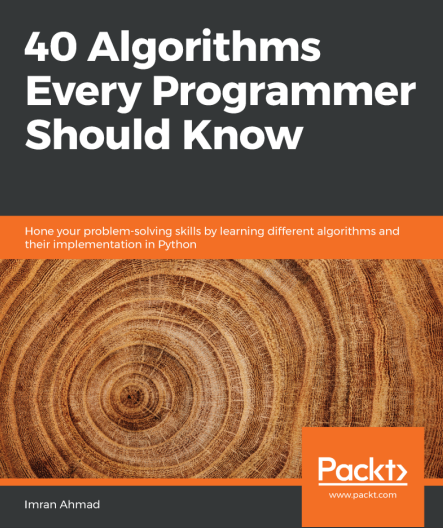

### 40 Algorithms Every Programmer Should Know

    
### Table of Contents

- [Section 1: Fundamentals and Core Algorithms]()

    - Chapter 1: Overview of Algorithms
    - Chapter 2: Data Structures Used in Algorithms
    - Chapter 3: Sorting and Searching Algorithms
    - Chapter 4: Designing Algorithms
    - Chapter 5: Graph Algorithms

- Section 2: Machine Learning Algorithms
    - Chapter 6: Unsupervised Machine Learning Algorithms
    - Chapter 7: Traditional Supervised Learning Algorithms
    - Chapter 8: Neural Network Algorithms
    - Chapter 9: Algorithms for Natural Language Processing
    - Chapter 10: Recommendation Engines 

- Section 3: Advanced Topics
    - Chapter 11: Data Algorithms
    - Chapter 12: Cryptography
    - Chapter 13: Large-Scale Algorithms
    - Chapter 14: Practical Considerations 326
